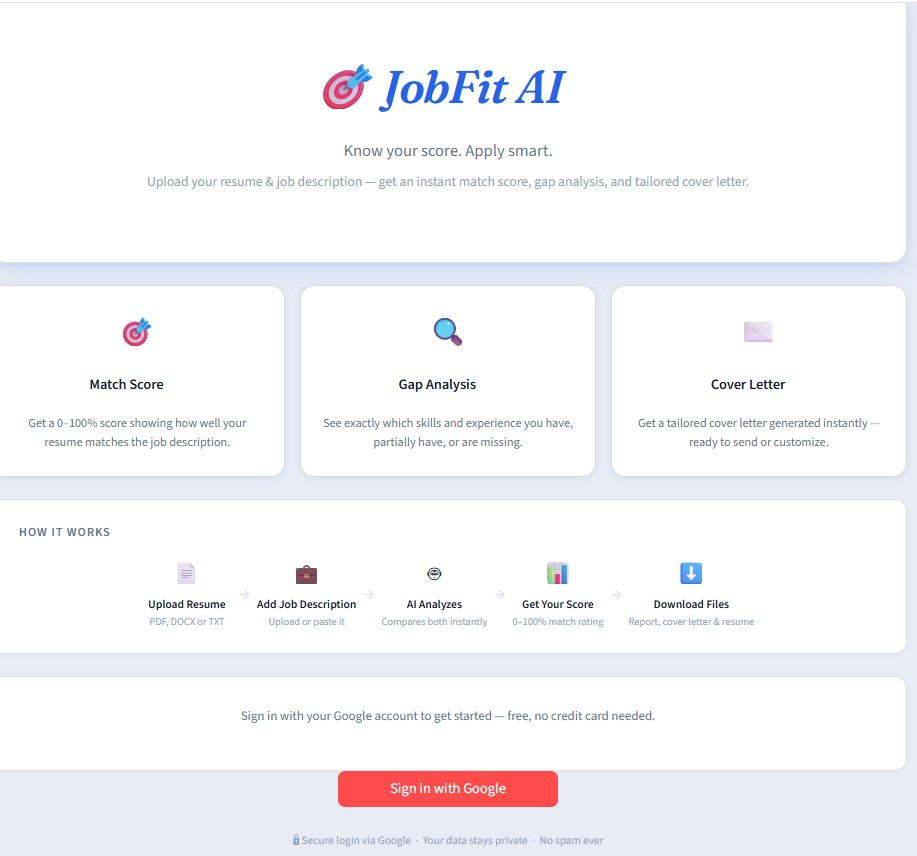
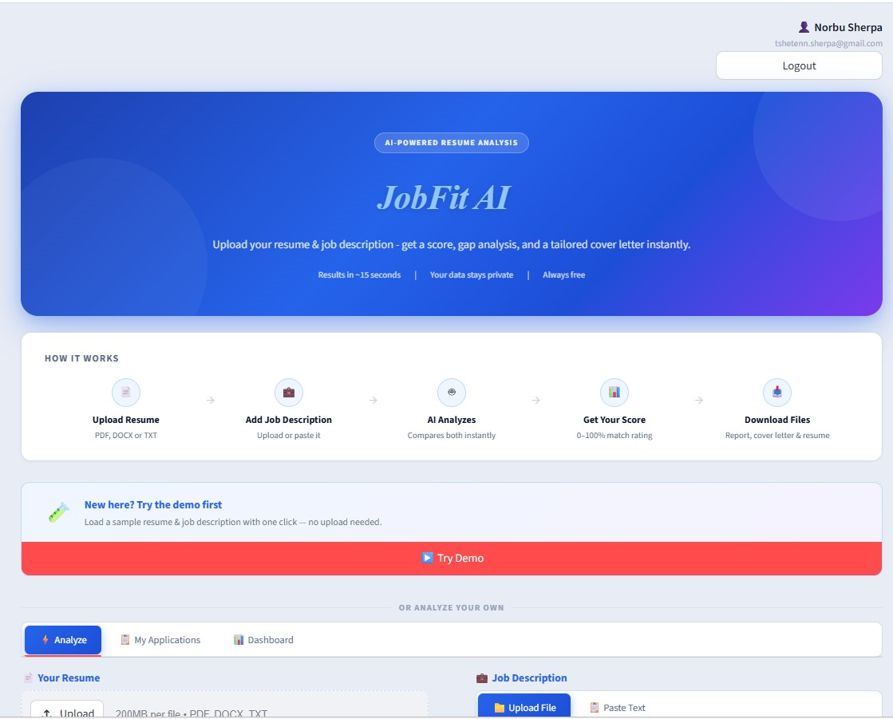
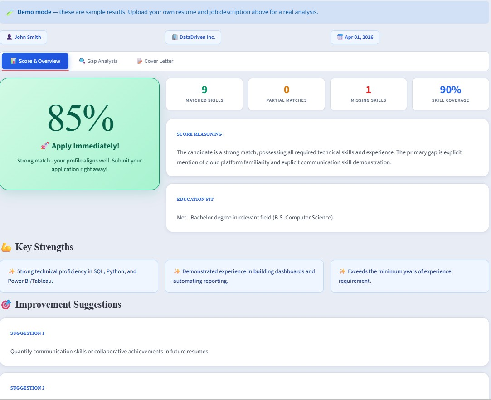
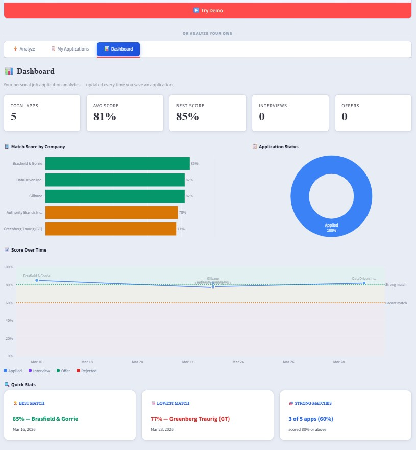

# 🎯 JobFit AI
## Live Site: https://jobready-ai.streamlit.app/
> **V4** — AI-powered resume analysis with application tracking, analytics dashboard, and Google OAuth.

[](https://jobready-ai.streamlit.app/)

---

## ✨ Features

| Feature | Details |
|---|---|
| **Match Score (0–100%)** | AI-powered fit score with color-coded verdict |
| **Gap Analysis** | Matched / Partial / Missing skills + experience gaps |
| **Cover Letter** | Auto-generated, editable, company-specific letter |
| **Download Files** | 3 separate `.docx` files — report, cover letter & resume |
| **Google OAuth** | Secure sign-in — each user sees only their own data |
| **Application Tracker** | Save, update status, and delete applications — persists across sessions |
| **Analytics Dashboard** | Score trends, status breakdown, best/worst matches |

### Score Legend

| Score | Verdict |
|---|---|
| **≥ 80%** | 🚀 Apply Immediately! |
| **60–79%** | 🤔 Consider Carefully |
| **< 60%** | ⚠️ Significant Gaps |

---

## 🚀 Quick Start

### 1. Clone
```bash
git clone https://github.com/tshetennsherpa-sudo/jobfit-ai.git
cd jobfit-ai
```

### 2. Install dependencies
```bash
pip install -r requirements.txt
```

### 3. Set your secrets
Create `.streamlit/secrets.toml`:
```toml
GEMINI_API_KEY = "your-gemini-api-key"
SUPABASE_URL   = "https://your-project-id.supabase.co"
SUPABASE_KEY   = "your-supabase-anon-key"

[auth]
redirect_uri         = "http://localhost:8501/oauth2callback"
cookie_secret        = "your-random-secret-string"

[auth.google]
client_id     = "your-google-client-id"
client_secret = "your-google-client-secret"
```

> 🔑 Gemini API key → [aistudio.google.com](https://aistudio.google.com) — use `gemini-2.5-flash-lite` for best free-tier quota
> 🗄️ Supabase project → [supabase.com](https://supabase.com)
> 🔐 Google OAuth credentials → [console.cloud.google.com](https://console.cloud.google.com)

### 4. Set up Supabase table

Create a table called `applications` with these columns:

| Column | Type | Notes |
|---|---|---|
| `id` | int8 | primary key, auto |
| `created_at` | timestamptz | auto |
| `company` | text | |
| `applicant` | text | |
| `score` | int2 | |
| `status` | text | |
| `notes` | text | |
| `date_applied` | date | |
| `user_id` | text | stores user email for per-user filtering |
| `deleted_at` | timestamptz | NULL = active, set to now() on delete (soft delete) |

> Run this migration if upgrading from V3:
> ```sql
> ALTER TABLE applications ADD COLUMN deleted_at timestamptz NULL;
> ```

### 5. Run
```bash
streamlit run app.py
```

---

## ☁️ Deploy on Streamlit Community Cloud

1. Push this repo to GitHub
2. Go to [share.streamlit.io](https://share.streamlit.io) → **New app**
3. Select your repo and `app.py`
4. Under **Advanced settings → Secrets**, paste the full contents of your `secrets.toml`
5. In Google Cloud Console, add your Streamlit Cloud URL to **Authorized redirect URIs**:
   ```
   https://your-app-name.streamlit.app/oauth2callback
   ```
6. Click **Deploy** 🎉

---

## 🗂️ Project Structure

```
jobfit-ai/
├── app.py               # Main Streamlit application
├── requirements.txt     # Python dependencies
├── .streamlit/
│   └── secrets.toml     # (local only, gitignored)
└── README.md
```
---
## Screenshots

  



---

## 🛠️ Tech Stack

| Layer | Technology |
|---|---|
| **Frontend / Backend** | [Streamlit](https://streamlit.io) |
| **AI Engine** | [Google Gemini API](https://aistudio.google.com) (`gemini-2.5-flash-lite`) via direct `requests` calls |
| **Authentication** | Streamlit built-in OAuth (v1.42+) + Google OAuth + `Authlib` |
| **Database** | [Supabase](https://supabase.com) (PostgreSQL) |
| **Charts** | [Plotly](https://plotly.com/python/) |
| **Report Generation** | `python-docx` |

---

## 📦 Versions

| Version | Highlights |
|---|---|
| **V1** | Core analysis — match score, gap analysis, cover letter |
| **V2** | DOCX downloads — report, cover letter, resume |
| **V3** | Google OAuth, per-user Supabase data, landing page |
| **V4** | Navigation tabs, delete (soft), analytics dashboard, demo banner above tabs |

---

## 📄 License

MIT — free to use, modify, and distribute.
